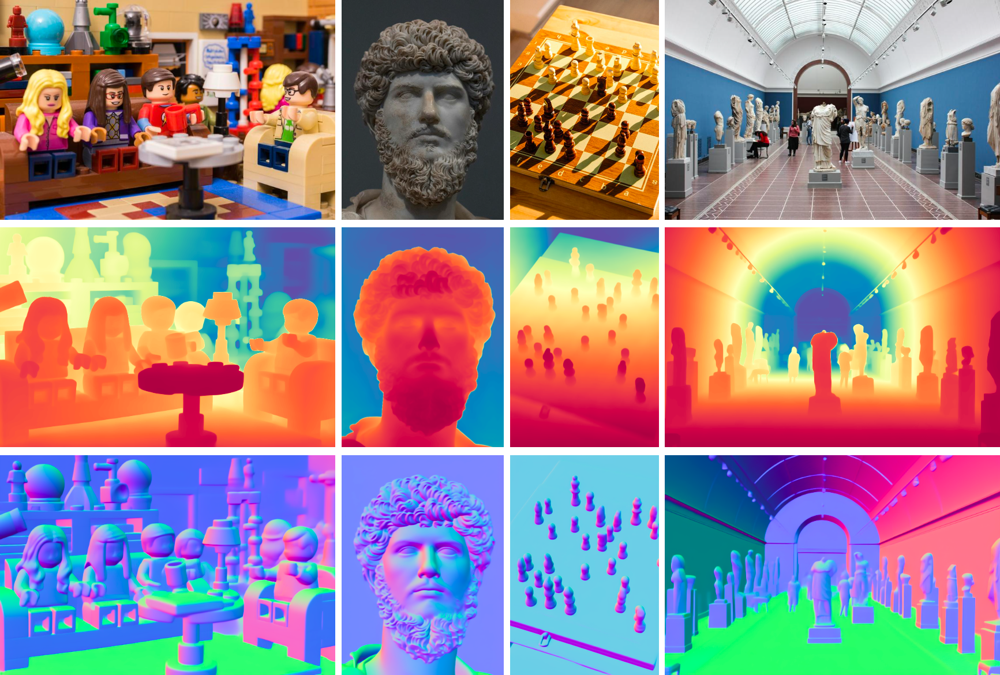

# Fine-Tuning Image-Conditional Diffusion Models

[[`Paper`](https://arxiv.org/abs/2409.11355)] [[`Project Page`](https://gonzalomartingarcia.github.io/diffusion-e2e-ft/)] [[`HF demo depth`](https://huggingface.co/spaces/GonzaloMG/marigold-e2e-ft-depth)] [[`HF demo normals`](https://huggingface.co/spaces/GonzaloMG/marigold-e2e-ft-normals)] [[`BibTeX`](#-Citation)]



## 📢 News
- 2024-10-28: Accepted to WACV 2025.
- 2024-10-17: Accepted to NeurIPS 2024 AFM Workshop.
- 2024-10-23: Training code release.
- 2024-09-24: Evaluation code release.
- 2024-09-18: Inference code release.

## ⏩ Quickstart

```bash
pip install torch diffusers transformers accelerate
```

```python
from diffusers import DiffusionPipeline
import diffusers

image = diffusers.utils.load_image(
    "https://gonzalomartingarcia.github.io/diffusion-e2e-ft/static/lego.jpg"
)

# Depth
pipe = DiffusionPipeline.from_pretrained(
    "GonzaloMG/marigold-e2e-ft-depth",
    custom_pipeline="GonzaloMG/marigold-e2e-ft-depth",
).to("cuda")
depth = pipe(image)
pipe.image_processor.visualize_depth(depth.prediction)[0].save("depth.png")
pipe.image_processor.export_depth_to_16bit_png(depth.prediction)[0].save("depth_16bit.png")


# Normals
pipe = DiffusionPipeline.from_pretrained(
    "GonzaloMG/stable-diffusion-e2e-ft-normals",
    custom_pipeline="GonzaloMG/marigold-e2e-ft-normals",
).to("cuda")
normals = pipe(image)
pipe.image_processor.visualize_normals(normals.prediction)[0].save("normals.png")
```

## 🔧 Development Setup
Tested with Python 3.10.
 1. Clone repository:

```bash
git clone https://github.com/VisualComputingInstitute/diffusion-e2e-ft.git
cd diffusion-e2e-ft
```

2. Install dependencies:

```bash
python -m venv .venv
source .venv/bin/activate
pip install -r requirements.txt
```

## 🤖 Models

The following checkpoints are available for inference. Note that the Marigold (Depth) and GeoWizard (Depth & Normals) diffusion estimators are the official checkpoints provided by their respective authors and were not trained by us. Following the Marigold training regimen, we have trained a Marigold diffusion estimator for normals.

"E2E FT" denotes models we have fine-tuned end-to-end on task-specific losses, either starting from the pretrained diffusion estimator or directly from Stable Diffusion.
Since the fine-tuned models are single-step deterministic models, the noise should always be `zeros` and the ensemble size and number of inference steps should always be `1`. 

| Models                        |  Diffusion Estimator          |  Stable Diffusion + E2E FT                  | Diffusion Estimator + E2E FT        |
|-------------------------------|-------------------------------|---------------------------------------------|-------------------------------------|
| **Marigold (Depth)**          | `prs-eth/marigold-depth-v1-0` | `GonzaloMG/stable-diffusion-e2e-ft-depth`   | `GonzaloMG/marigold-e2e-ft-depth`   |
| **Marigold (Normals)**        | `GonzaloMG/marigold-normals`  | `GonzaloMG/stable-diffusion-e2e-ft-normals` | `GonzaloMG/marigold-e2e-ft-normals` |
| **GeoWizard (Depth&Normals)** | `lemonaddie/geowizard`        | N/A                                         |  `GonzaloMG/geowizard-e2e-ft`       |

## 🏃 Inference

1. Marigold checkpoints:
```bash
python Marigold/run.py \
    --checkpoint="GonzaloMG/marigold-e2e-ft-depth" \
    --modality depth \
    --input_rgb_dir="input" \
    --output_dir="output/marigold_ft"
```

```bash
python Marigold/run.py \
    --checkpoint="GonzaloMG/marigold-e2e-ft-normals" \
    --modality normals \
    --input_rgb_dir="input" \
    --output_dir="output/marigold_ft"
```

| Argument                | Description |
|-------------------------|-------------|
| `--checkpoint`            | Hugging Face model path. |
| `--modality`              | Output modality; `depth` or `normals`. |
| `--input_rgb_dir`         | Path to the input images. |
| `--output_dir`            | Path to the output depth or normal images. |
| `--denoise_steps`         | Number of inference steps; default `1` for E2E FT models. |
| `--ensemble_size`         | Number of samples for ensemble; default `1` for E2E FT models. |
| `--timestep_spacing`      | Defines how timesteps are distributed; `trailing` or `leading`; default `trailing` for the fixed inference schedule. |
| `--noise`                 | Noise types; `gaussian`, `pyramid`, or `zeros`; default `zeros` for E2E FT models. |
| `--processing_res`        | Resolution the model uses for generation; `0` for matching the RGB input resolution; default `768`. |
| `--output_processing_res` | If `True`, the generated image is not resized to match the RGB input resolution; default `False`. |
| `--half_precision`        | If `True`, operations are performed in half precision; default `False`. |
| `--seed`                  | Sets the seed. |
| `--batch_size`            | Batched inference when ensembling; default `1`. |
| `--resample_method`       | Resampling method used for resizing the RGB input and generated output; `bilinear`, `bicubic`, or `nearest`; default `bilinear`. |


2. GeoWizard checkpoints:

```bash
python GeoWizard/run_infer.py \
    --pretrained_model_path="GonzaloMG/geowizard-e2e-ft" \
    --domain indoor \
    --input_dir="input" \
    --output_dir="output/geowizard_ft"
```

| Argument                | Description |
|-------------------------|-------------|
| `--pretrained_model_path` | Hugging Face model path. |
| `--domain`                | Domain with respect to the RGB input; `indoor`, `outdoor`, or `object`. |
| `--input_dir`             | Path to the input images. |
| `--output_dir`            | Path to the output depth and normal images. |
| `--denoise_steps`         | Number of inference steps; default `1` for E2E FT models. |
| `--ensemble_size`         | Number of samples for ensemble; default `1` for E2E FT models. |
| `--timestep_spacing`      | Defines how timesteps are distributed; `trailing` or `leading`; default `trailing` for the fixed inference schedule. |
| `--noise`                 | Noise types; `gaussian`, `pyramid`, or `zeros`; default `zeros` for E2E FT models. |
| `--processing_res`        | Resolution the model uses for generation; `0` for matching the RGB input resolution; default `768`. |
| `--output_processing_res` | If `True`, the generated image is not resized to match the RGB input resolution; default `False`.  |
| `--half_precision`        | If `True`, operations are performed in half precision; default `False`. |
| `--seed`                  | Sets the seed.  |

By using the correct `trailing` timestep spacing, it is possible to sample single to few-step depth maps and surface normals from diffusion estimators. These samples will be blurry but become sharper by increasing the number of inference steps, e.g., from `10` to `50`. Metrics can be improved by increasing the ensemble size, e.g., to `10`. Since diffusion estimators are probabilistic models, the noise setting can be adjusted to either `gaussian` noise or multiresolution `pyramid` noise.

Our single-step deterministic E2E FT models outperform the previously mentioned diffusion estimators.

## 📋 Metrics

| Depth Method                | Inference Time   | NYUv2 AbsRel↓ | KITTI AbsRel↓  | ETH3D AbsRel↓| ScanNet AbsRel↓ | DIODE AbsRel↓  |
|-----------------------------|------------------|---------------|----------------|--------------|-----------------|----------------|
| Stable Diffusion + E2E FT   | **121ms**        | 5.4           | **9.6**        | 6.4          | **5.8**         |  30.3          |
| Marigold + E2E FT           | **121ms**        | **5.2**       | **9.6**        | **6.2**      | **5.8**         | **30.2**       |
| GeoWizard + E2E FT          | **254ms**        | **5.6**       | 9.8            | 6.3          | 5.9             | 30.6           |


| Normals Method            | Inference Time | NYUv2 Mean↓  | ScanNet Mean↓ | iBims-1 Mean↓ | Sintel Mean↓  |
|---------------------------|----------------|--------------|---------------|---------------|---------------|
| Stable Diffusion + E2E FT | **121ms**      | 16.5         | 15.3          | 16.1          | 33.5          |
| Marigold + E2E FT         | **121ms**      | 16.2         | **14.7**      | **15.8**      | 33.5          |
| GeoWizard + E2E FT        | **254ms**      | **16.1**     | **14.7**      | 16.2          | **33.4**      |

Inference time is for a single 576x768-pixel image, evaluated on an NVIDIA RTX 4090 GPU.

## 📊 Evaluation

We utilize the official [Marigold](https://github.com/prs-eth/Marigold) evaluation pipeline to evaluate the affine-invariant depth estimation checkpoints, and we use the official [DSINE](https://github.com/baegwangbin/DSINE) evaluation pipeline to evaluate the surface normals estimation checkpoints. The code has been streamlined to exclude unnecessary parts, and changes have been marked.


### Depth

The Marigold evaluation datasets can be downloaded to `data/marigold_eval/` at the root of the project using the following snippet:
```bash
wget -r -np -nH --cut-dirs=4 -R "index.html*" -P data/marigold_eval/ https://share.phys.ethz.ch/~pf/bingkedata/marigold/evaluation_dataset/
```
After downloading, the folder structure should look as follows:
```
data
└── marigold_eval
    ├── diode
    │   └── diode_val.tar
    ├── eth3d
    │   └── eth3d.tar
    ├── kitti
    │   └── kitti_eigen_split_test.tar
    ├── nyuv2
    │   └── nyu_labeled_extracted.tar
    └── scannet
        └── scannet_val_sampled_800_1.tar
```

Run the `0_infer_eval_all.sh` script to evaluate the desired model on all datasets.

```bash
./experiments/depth/eval_args/marigold_e2e_ft/0_infer_eval_all.sh
```
```bash
./experiments/depth/eval_args/stable_diffusion_e2e_ft/0_infer_eval_all.sh
```
```bash
./experiments/depth/eval_args/geowizard_e2e_ft/0_infer_eval_all.sh
```

The evaluation results for the selected model are located in the `experiments/depth/marigold` directory. For a given dataset, the script first performs the necessary inference, storing the estimations in a `prediction` folder. Later, these depth maps are aligned and evaluated against the ground truth. Metrics and evaluation settings are available as `.txt` files.

```
<model>
└── <dataset>
    ├── arguments.txt
    ├── eval_metric
    │   └── eval_metrics-least_square.txt
    └── prediction
```


### Normals

The [DSINE evaluation datasets (`dsine_eval.zip`)](https://drive.google.com/drive/folders/1t3LMJIIrSnCGwOEf53Cyg0lkSXd3M4Hm) should be extracted into the `data` folder at the root of the project.
The folder structure should look as follows:
```
data
└── dsine_eval
   ├── ibims
   ├── nyuv2
   ├── oasis
   ├── scannet
   ├── sintel
   └── vkitti
```

Run the following commands to evaluate the models on all datasets.

```bash
python -m DSINE.projects.dsine.test \
    experiments/normals/eval_args/marigold_e2e_ft.txt \
    --mode benchmark
```
```bash
python -m DSINE.projects.dsine.test \
    experiments/normals/eval_args/stable_diffusion_e2e_ft.txt \
    --mode benchmark
```
```bash
python -m DSINE.projects.dsine.test \
    experiments/normals/eval_args/geowizard_e2e_ft.txt \
    --mode benchmark
```

Evaluation results are saved in the `experiments/normals/dsine` folder. This includes the used settings (`params.txt`) and the metrics for each `<dataset>` (`metrics.txt`).

```
dsine
  └── <model-type/model>
      ├── log
      │   └── params.txt
      └── test
          └── <dataset>
              └── metrics.txt
```

## 🏋️ Training

### Datasets

The fine-tuned models are trained on the [Hypersim](https://github.com/apple/ml-hypersim) and [Virtual KITTI 2](https://europe.naverlabs.com/research/computer-vision/proxy-virtual-worlds-vkitti-2/) datasets.


#### Hypersim

Download the [Hypersim](https://github.com/apple/ml-hypersim) dataset using the [dataset_download_images.py](https://github.com/apple/ml-hypersim/blob/20f398f4387aeca73175494d6a2568f37f372150/code/python/tools/dataset_download_images.py) script and unzip the files to `data/hypersim/raw_data` at the root of the project. Download the scene split file from the [Hypersim repository](https://github.com/apple/ml-hypersim/blob/main/evermotion_dataset/analysis/metadata_images_split_scene_v1.csv) and place it in `data/hypersim`.

```
data
└── hypersim
    ├── metadata_images_split_scene_v1.csv
    └── raw_data
        ├── ai_001_001
        ├── ...
        └── ai_055_010
```

Run Marigold's preprocessing script, which will save the processed data to `data/hypersim/processed`.
```bash
python Marigold/script/dataset_preprocess/hypersim/preprocess_hypersim.py \
  --split_csv data/hypersim/metadata_images_split_scene_v1.csv
```

Download the surface normals in `png` format using Hypersim's [`download.py`](https://github.com/apple/ml-hypersim/tree/20f398f4387aeca73175494d6a2568f37f372150/contrib/99991) script.
```bash
./download.py --contains normal_cam.png --silent
```
Place the downloaded surface normals in `data/hypersim/processed/normals`.

The final processed file structure should look like this:
```
data
└── hypersim
    └── processed
        ├── normals
        │   ├── ai_001_001
        │   ├── ...
        │   └── ai_055_010
        └── train
            ├── ai_001_001
            ├── ...
            ├── ai_055_010
            └── filename_meta_train.csv
```

#### Virtual KITTI 2

Download the RGB (`vkitti_2.0.3_rgb.tar`) and depth (`vkitti_2.0.3_depth.tar`) files from the [official website](https://europe.naverlabs.com/research/computer-vision/proxy-virtual-worlds-vkitti-2/). Place them in `data/virtual_kitti_2` at the root of the project and finally extract them using the following shell commands.

```bash
mkdir vkitti_2.0.3_rgb && tar -xf vkitti_2.0.3_rgb.tar -C vkitti_2.0.3_rgb
mkdir vkitti_2.0.3_depth && tar -xf vkitti_2.0.3_depth.tar -C vkitti_2.0.3_depth
```

Virtual KITTI 2 does not provide surface normals. Therefore, we estimate them from the depth maps using [discontinuity-aware gradient filters](https://github.com/fengyi233/depth-to-normal-translator). Run our provided script to generate the normals which will be saved to `data/virtual_kitti_2/vkitti_DAG_normals`.

```bash
python depth-to-normal-translator/python/gen_vkitti_normals.py
```

The final processed file structure should look like this:

```
data
└── virtual_kitti_2
    ├── vkitti_2.0.3_depth
    │   ├── Scene01
    │   ├── Scene02
    │   ├── Scene06
    │   ├── Scene18
    │   └── Scene20
    ├── vkitti_2.0.3_rgb
    │   ├── Scene01
    │   ├── Scene02
    │   ├── Scene06
    │   ├── Scene18
    │   └── Scene20
    └── vkitti_DAG_normals
        ├── Scene01
        ├── Scene02
        ├── Scene06
        ├── Scene18
        └── Scene20
```

### E2E FT Model Training

To train the end-to-end fine-tuned depth and normals models, run the scripts in the `training/scripts` directory:
```bash
./training/scripts/train_marigold_e2e_ft_depth.sh
```
```bash
./training/scripts/train_stable_diffusion_e2e_ft_depth.sh
```
```bash
./training/scripts/train_marigold_e2e_ft_normals.sh
```
```bash
./training/scripts/train_stable_diffusion_e2e_ft_normals.sh
```
```bash
./training/scripts/train_geowizard_e2e_ft.sh
```

The fine-tuned models will be saved to `model-finetuned` at the root of the project.

```bash
model-finetuned
    └── <model>
        ├── arguments.txt
        ├── model_index.json
        ├── text_encoder # or image_encoder for GeoWizard
        ├── tokenizer
        ├── feature_extractor
        ├── scheduler
        ├── vae
        └── unet 
```

> [!NOTE]  
> For multi GPU training, set the desired number of devices and nodes in the `training/scripts/multi_gpu.yaml` file and replace `accelerate launch` with `accelerate launch --multi_gpu --config_file training/scripts/multi_gpu.yaml` in the training scripts.

## 🎓 Citation

If you use our work in your research, please use the following BibTeX entry.

```
@InProceedings{martingarcia2024diffusione2eft,
  title     = {Fine-Tuning Image-Conditional Diffusion Models is Easier than You Think},
  author    = {Martin Garcia, Gonzalo and Abou Zeid, Karim and Schmidt, Christian and de Geus, Daan and Hermans, Alexander and Leibe, Bastian},
  booktitle = {Proceedings of the IEEE/CVF Winter Conference on Applications of Computer Vision (WACV)},
  year      = {2025}
}
```
